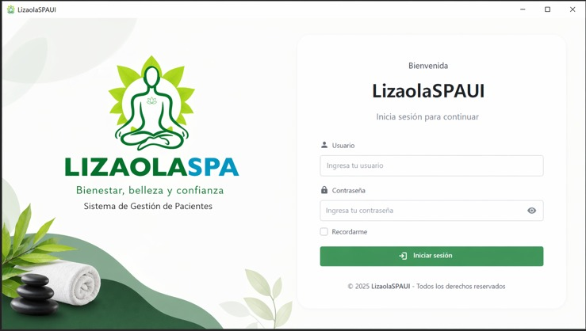

LizaolaSPAUI
Clinical Management Desktop App

LizaolaSPAUI is a desktop application built with Python and SQLite for managing patients and clinical records. It offers a clean interface and efficient data handling, making it ideal for small clinics or medical projects.

✨ Key Features
🧑‍⚕️ Patient registration and management
📋 Clinical records (expediente clínico)
📊 Interactive dashboard
💾 Lightweight database (SQLite)
🖥️ Simple and intuitive UI
📸 Preview

(You can add screenshots here later)

# Example:
# 
🛠️ Tech Stack
Python
Tkinter (GUI)
SQLite
📁 Project Structure
lizaolaspaui/
│── main.py
│── dashboard.py
│── init_db.py
│
├── config/
│   └── db.py
│
├── services/
├── ui/
└── assets/
⚙️ Getting Started
1. Clone the repository
git clone https://github.com/your-username/lizaolaspaui.git
2. Navigate into the project
cd lizaolaspaui
3. Initialize the database
python init_db.py
4. Run the app
python main.py
📌 Requirements
Python 3.10 or higher
No external database required (SQLite included)
🚧 Future Improvements
🔐 User authentication system
📈 Advanced analytics and reports
☁️ Cloud database integration
🧾 Export records (PDF/Excel)
👨‍💻 Author

Jose Manuel Garcia Lizaola
Software Developer Student

⭐ Support

If you like this project, consider giving it a star ⭐ on GitHub!
